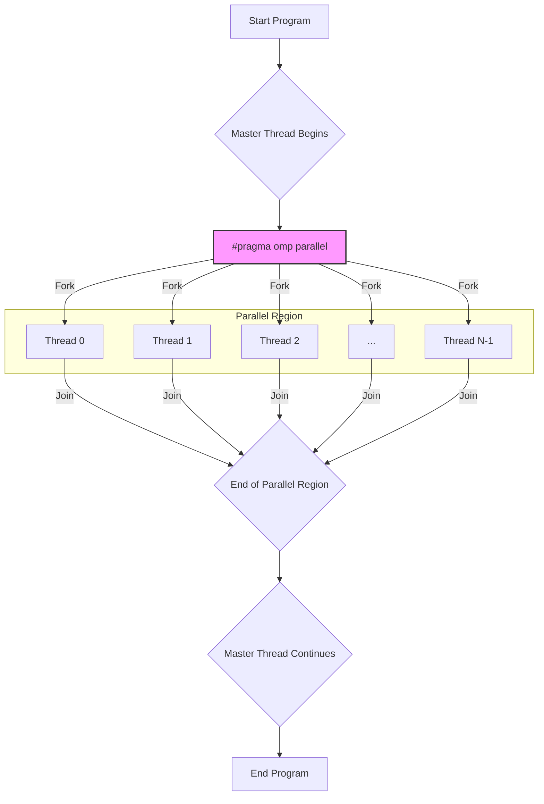
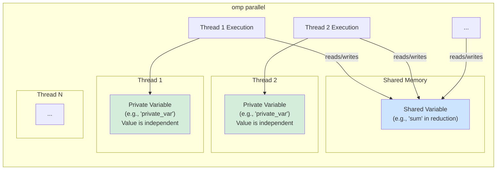
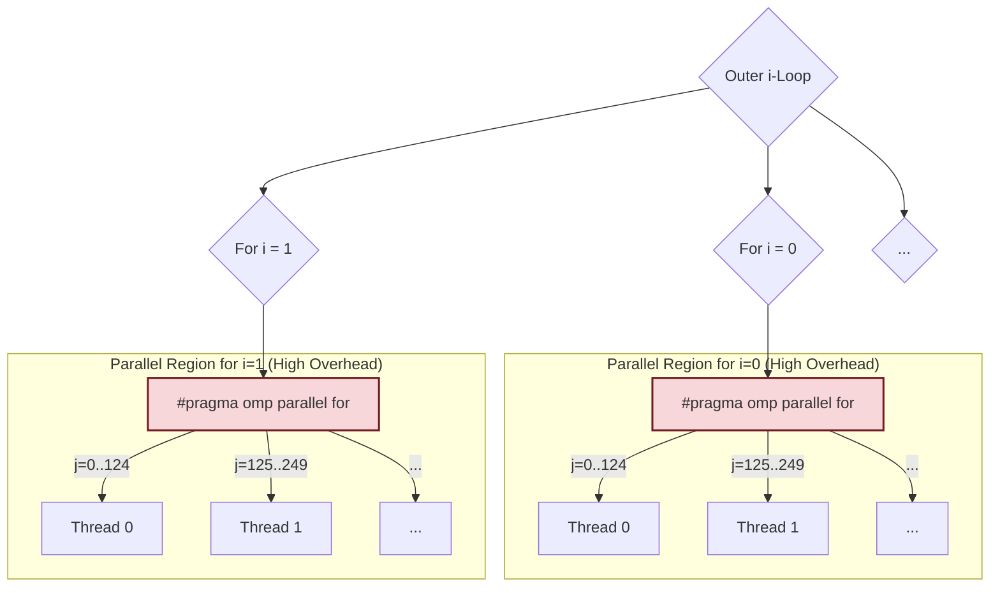

# Task 2A: Parallelism Portfolio - Screenshot and Diagram Guide

This document provides a guide for generating screenshots and diagrams for the OpenMP programs in this portfolio.

---

## 📸 Part A: Enhanced OpenMP Hello World

### Recommended Diagrams

#### 1. Basic OpenMP Execution Flow

This diagram shows how a master thread forks a team of parallel threads and joins them after the parallel region is complete.



#### 2. Private vs. Shared Variables

This diagram illustrates the concepts of `shared` and `private` variables as seen in the `demonstrate_advanced_features` function.



---

## 📸 Part B: Enhanced Vector Addition

### Recommended Diagrams

#### 1. Static Scheduling (`schedule(static)`)

Illustrates how static scheduling divides iterations into contiguous, pre-determined chunks. This is ideal for loops where each iteration takes a similar amount of time.

```mermaid
gantt
    title Static Scheduling (12 Iterations, 4 Threads)
    dateFormat  X
    axisFormat %s

    section Thread 0
    Chunk 1: 0, 3, 3

    section Thread 1
    Chunk 2: 3, 3, 3

    section Thread 2
    Chunk 3: 6, 3, 3

    section Thread 3
    Chunk 4: 9, 3, 3
```



#### 2. Dynamic Scheduling (`schedule(dynamic, chunk_size)`)

Shows how dynamic scheduling assigns smaller chunks of iterations to threads as they become available. This is better for loops with varying iteration runtimes, as it provides better load balancing.

```mermaid
gantt
    title Dynamic Scheduling (chunk_size=1, 4 Threads)
    dateFormat X
    axisFormat %s

    section Thread 0
    Iter 0: 0, 1, 1
    Iter 4: 4, 1, 1
    Iter 8: 8, 1, 1

    section Thread 1
    Iter 1: 1, 1, 1
    Iter 5: 5, 1, 1
    Iter 9: 9, 1, 1

    section Thread 2
    Iter 2: 2, 1, 1
    Iter 6: 6, 1, 1
    Iter 10: 10, 1, 1

    section Thread 3
    Iter 3: 3, 1, 1
    Iter 7: 7, 1, 1
    Iter 11: 11, 1
```



---

## 📸 Part C: Enhanced Matrix Calculation

### Recommended Diagrams

#### 1. Outer Loop Parallelization

This is the more efficient method. The parallel region is created only once, and each thread takes a large chunk of the outer loop's iterations to work on. This minimizes thread creation overhead.

```mermaid
graph TD
    A["#pragma omp parallel for"] --> B{i-Loop<br>(e.g., i=0 to 499)};

    subgraph "Single Parallel Region (Low Overhead)"
        B -- "i=0..124" --> T1["Thread 0<br>Executes inner j-loop and k-loop<br>for its assigned 'i' values"];
        B -- "i=125..249" --> T2["Thread 1<br>..."];
        B -- "i=250..374" --> T3["Thread 2<br>..."];
        B -- "i=375..499" --> T4["Thread 3<br>..."];
    end

    style A fill:#f9f,stroke:#333,stroke-width:2px
```

#### 2. Inner Loop Parallelization

This method is less efficient. A new parallel region is created for _each iteration_ of the outer loop. The repeated creation and destruction of threads leads to very high overhead.



---

## 📷 Screenshot Documentation Guide

### **Screenshot Organization Structure**

Create the following directory structure for your screenshots:

```
SCREENSHOTS/
├── PART_A_HELLO_WORLD/
│   ├── 01_system_verification.png
│   ├── 02_thread_creation_demo.png
│   ├── 03_private_shared_variables.png
│   └── 04_compilation_success.png
├── PART_B_VECTOR_ADDITION/
│   ├── 05_scheduling_comparison.png
│   ├── 06_vector_size_scaling.png
│   ├── 07_chunk1_overhead_demo.png
│   ├── 08_chunk_optimization.png
│   └── 09_static_vs_dynamic_results.png
├── PART_C_MATRIX_CALCULATION/
│   ├── 10_outer_vs_inner_comparison.png
│   ├── 11_thread_scaling_analysis.png
│   ├── 12_large_matrix_performance.png
│   └── 13_gflops_efficiency.png
├── CODE_SNIPPETS/
│   ├── 14_part_a_key_code.png
│   ├── 15_part_b_scheduling_code.png
│   ├── 16_part_c_parallelization_code.png
│   └── 17_compilation_commands.png
└── SUPPLEMENTARY/
    ├── 18_cpu_utilization.png
    ├── 19_performance_variation.png
    └── 20_system_specs.png
```

---

## 📸 **Part A: Enhanced OpenMP Hello World - Screenshot Requirements**

### **Screenshot 01: System Verification Output**
**What to capture**: Terminal output showing:
```
System: Linux 6.11.0-29-generic x86_64
CPU: AMD Ryzen 7 8845HS w/ Radeon 780M Graphics
Logical cores: 8
Max OpenMP threads: 8
OpenMP version: 201511
```
**Why important**: Establishes testing environment and hardware baseline

### **Screenshot 02: Thread Creation Demonstration**
**What to capture**: Program output showing:
- 10-thread hardcoded execution with thread IDs
- User-specified thread count (e.g., 4 threads)
- Execution times for both configurations
**Why important**: Proves OpenMP thread management works correctly

### **Screenshot 03: Private vs Shared Variables Demo**
**What to capture**: Output from `demonstrate_advanced_features()` showing:
- Private variable values per thread (should be different)
- Shared reduction results (should be consistent)
- Critical section demonstration
**Why important**: Demonstrates understanding of OpenMP variable scoping

### **Screenshot 04: Compilation Success**
**What to capture**: Terminal showing successful compilation:
```bash
gcc -fopenmp -O2 -o part_a_enhanced part_a_enhanced.c -lm
echo $?  # Should show 0 for success
```

---

## 📸 **Part B: Enhanced Vector Addition - Screenshot Requirements**

### **Screenshot 05: Scheduling Strategy Comparison**
**What to capture**: Side-by-side output showing all 4 scheduling types:
- Static scheduling results
- Dynamic scheduling results  
- Guided scheduling results
- Auto scheduling results
**Include**: Vector size, thread count, execution times for each strategy

### **Screenshot 06: Vector Size Scaling Results**
**What to capture**: Performance across multiple vector sizes:
- 100K elements performance
- 1M elements performance  
- 5M elements performance
**Show**: How execution time scales with problem size

### **Screenshot 07: Chunk Size 1 Overhead Demonstration**
**What to capture**: The extreme overhead comparison:
```
Static: 0.0029ms vs Dynamic(chunk=1): 0.2885ms
Overhead: +9682% slower!
```
**Why important**: Visual evidence of synchronization overhead

### **Screenshot 08: Chunk Size Optimization**
**What to capture**: Dynamic scheduling with different chunk sizes:
- Chunk=1: 0.6022ms
- Chunk=100: 0.0041ms  
- Chunk=1000: 0.0020ms
- Chunk=2000: 0.0018ms
**Show**: Performance improvement from chunk size tuning

### **Screenshot 09: Static vs Dynamic Comprehensive Results**
**What to capture**: Complete comparison table showing:
- Multiple vector sizes (1K, 10K, 50K, 100K, 500K)
- Thread scaling (1, 2, 4, 8 threads)
- Performance winner for each configuration

---

## 📸 **Part C: Enhanced Matrix Calculation - Screenshot Requirements**

### **Screenshot 10: Outer vs Inner Loop Comparison**
**What to capture**: Side-by-side performance results:
- Outer loop parallelization times
- Inner loop parallelization times
- GFLOPS calculations for both
- Speedup and efficiency metrics

### **Screenshot 11: Thread Scaling Analysis**
**What to capture**: Performance across thread counts:
- 1, 4, 8, 16 threads for 500x500 matrix
- Execution times, speedup ratios
- Efficiency percentages
**Show**: Diminishing returns beyond optimal thread count

### **Screenshot 12: Large Matrix Performance (1000x1000)**
**What to capture**: Best-case performance results:
- Outer loop: 6.95 GFLOPS, 4.61x speedup
- Inner loop: Poor scaling with 16 threads
- Clear winner demonstration

### **Screenshot 13: GFLOPS and Efficiency Metrics**
**What to capture**: Complete performance table showing:
- Matrix sizes (50x50, 500x500, 1000x1000)
- GFLOPS calculations
- Efficiency percentages (0.1% to 119.8%)

---

## 💻 **Code Snippets to Screenshot**

### **Screenshot 14: Part A Key Code Sections**
**File**: `part_a_enhanced.c`
**Sections to capture**:

1. **OpenMP Parallel Region**:
```c
#pragma omp parallel
{
    int thread_id = omp_get_thread_num();
    int total_threads = omp_get_num_threads();
    printf("Hello from thread %d of %d\n", thread_id, total_threads);
}
```

2. **Advanced Features Function**:
```c
void demonstrate_advanced_features() {
    #pragma omp parallel private(private_var) shared(shared_sum)
    {
        // Private and shared variable demonstration
        #pragma omp for reduction(+:shared_sum)
        for (int i = 0; i < 1000; i++) {
            shared_sum += i;
        }
    }
}
```

### **Screenshot 15: Part B Scheduling Code**
**File**: `part_b_enhanced.c`
**Sections to capture**:

1. **Static Scheduling**:
```c
#pragma omp parallel for schedule(static)
for (int i = 0; i < vector_size; i++) {
    result[i] = vector_a[i] + vector_b[i];
}
```

2. **Dynamic Scheduling with Chunk Size**:
```c
#pragma omp parallel for schedule(dynamic, chunk_size)
for (int i = 0; i < vector_size; i++) {
    result[i] = vector_a[i] + vector_b[i];
}
```

3. **Performance Measurement Code**:
```c
start_time = omp_get_wtime();
// Parallel computation here
end_time = omp_get_wtime();
execution_time = end_time - start_time;
```

### **Screenshot 16: Part C Parallelization Code**
**File**: `part_c_enhanced.c`
**Sections to capture**:

1. **Outer Loop Parallelization**:
```c
#pragma omp parallel for
for (int i = 0; i < size; i++) {
    for (int j = 0; j < size; j++) {
        for (int k = 0; k < size; k++) {
            result[i][j] += matrix_a[i][k] * matrix_b[k][j];
        }
    }
}
```

2. **Inner Loop Parallelization**:
```c
for (int i = 0; i < size; i++) {
    #pragma omp parallel for
    for (int j = 0; j < size; j++) {
        for (int k = 0; k < size; k++) {
            result[i][j] += matrix_a[i][k] * matrix_b[k][j];
        }
    }
}
```

3. **GFLOPS Calculation**:
```c
double gflops = (2.0 * size * size * size) / (execution_time * 1e9);
double speedup = serial_time / parallel_time;
double efficiency = (speedup / num_threads) * 100.0;
```

### **Screenshot 17: Compilation Commands**
**What to capture**: Terminal showing compilation process:
```bash
# Part A compilation
gcc -fopenmp -O2 -o part_a_enhanced part_a_enhanced.c -lm

# Part B compilation  
gcc -fopenmp -O2 -o part_b_enhanced part_b_enhanced.c -lm

# Part C compilation
gcc -fopenmp -O2 -o part_c_enhanced part_c_enhanced.c -lm

# Static vs Dynamic programs
gcc -fopenmp -O2 -o part_b_static_vs_dynamic_chunk1 part_b_static_vs_dynamic_chunk1.c -lm
gcc -fopenmp -O2 -o part_b_vector_static_vs_dynamic part_b_vector_static_vs_dynamic.c -lm
```

---

## 📊 **Supplementary Screenshots**

### **Screenshot 18: CPU Utilization During Parallel Execution**
**What to capture**: `htop` or `top` output showing:
- Multiple CPU cores active during parallel execution
- CPU usage percentages across cores
- Memory utilization
**Command**: `htop` while running parallel programs

### **Screenshot 19: Performance Variation Evidence**
**What to capture**: Multiple runs of the same test showing:
- Variation in static scheduling performance
- Consistent dynamic scheduling performance
- Statistical evidence supporting virtualization hypothesis

### **Screenshot 20: Complete System Specifications**
**What to capture**: System information commands:
```bash
lscpu | head -20
cat /proc/version
free -h
uname -a
```

---

## 🎯 **Screenshot Best Practices**

### **Technical Guidelines**:
1. **Use clear terminal fonts** (Ubuntu Mono, Consolas, or similar)
2. **Set appropriate zoom level** for readability (at least 12pt font)
3. **Use consistent terminal size** across all screenshots
4. **Include command prompts** to show what was executed
5. **Capture full output** including timing measurements
6. **Use terminal selection** to highlight key numbers if possible

### **Content Guidelines**:
1. **Show timestamps** when experiments were run
2. **Include system context** (working directory, user, etc.)
3. **Capture compilation success** (return codes, no errors)
4. **Document exact commands used** for reproducibility
5. **Include performance metrics** clearly visible
6. **Show statistical variations** where relevant

### **Organization Guidelines**:
1. **Name files descriptively** with numbers for ordering
2. **Group by portfolio part** for easy navigation
3. **Include both output and code** screenshots
4. **Create a master index** of all screenshots
5. **Backup originals** in high resolution
6. **Export in common formats** (PNG preferred for quality)

This comprehensive screenshot guide will provide compelling visual evidence of your parallel programming mastery and support all performance claims in your analysis!
