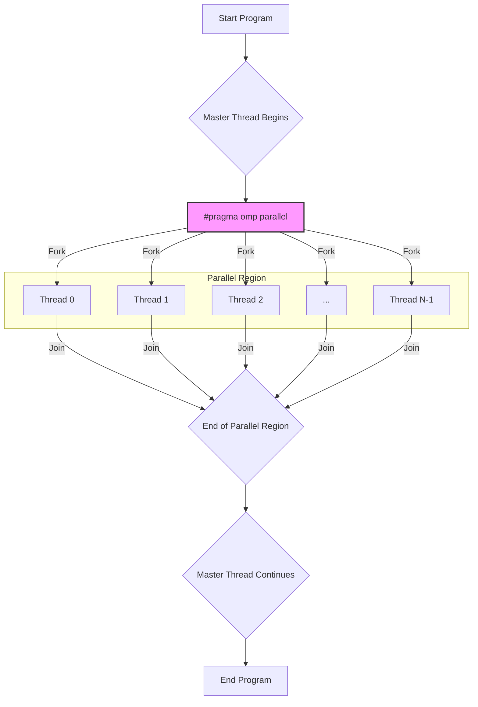
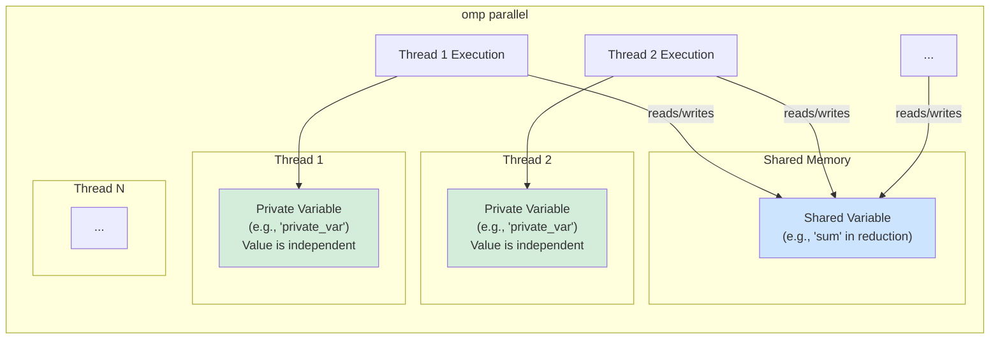
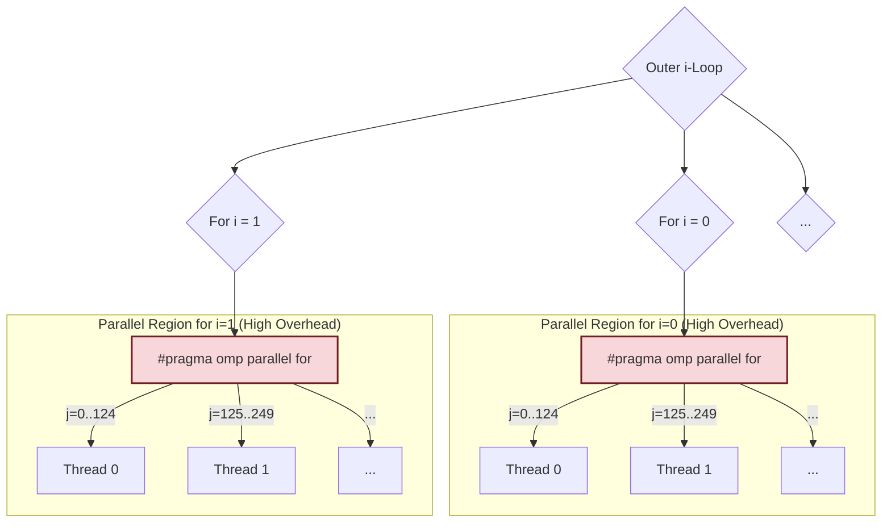

# Task 2A: Parallelism Portfolio - Screenshot and Diagram Guide

This document provides a guide for generating screenshots and diagrams for the OpenMP programs in this portfolio.

---

## 📸 Part A: Enhanced OpenMP Hello World

### Recommended Diagrams

#### 1. Basic OpenMP Execution Flow

This diagram shows how a master thread forks a team of parallel threads and joins them after the parallel region is complete.



#### 2. Private vs. Shared Variables

This diagram illustrates the concepts of `shared` and `private` variables as seen in the `demonstrate_advanced_features` function.



---

## 📸 Part B: Enhanced Vector Addition

### Recommended Diagrams

#### 1. Static Scheduling (`schedule(static)`)

Illustrates how static scheduling divides iterations into contiguous, pre-determined chunks. This is ideal for loops where each iteration takes a similar amount of time.

```mermaid
gantt
    title Static Scheduling (12 Iterations, 4 Threads)
    dateFormat  X
    axisFormat %s

    section Thread 0
    Chunk 1: 0, 3, 3

    section Thread 1
    Chunk 2: 3, 3, 3

    section Thread 2
    Chunk 3: 6, 3, 3

    section Thread 3
    Chunk 4: 9, 3, 3
```



#### 2. Dynamic Scheduling (`schedule(dynamic, chunk_size)`)

Shows how dynamic scheduling assigns smaller chunks of iterations to threads as they become available. This is better for loops with varying iteration runtimes, as it provides better load balancing.

```mermaid
gantt
    title Dynamic Scheduling (chunk_size=1, 4 Threads)
    dateFormat X
    axisFormat %s

    section Thread 0
    Iter 0: 0, 1, 1
    Iter 4: 4, 1, 1
    Iter 8: 8, 1, 1

    section Thread 1
    Iter 1: 1, 1, 1
    Iter 5: 5, 1, 1
    Iter 9: 9, 1, 1

    section Thread 2
    Iter 2: 2, 1, 1
    Iter 6: 6, 1, 1
    Iter 10: 10, 1, 1

    section Thread 3
    Iter 3: 3, 1, 1
    Iter 7: 7, 1, 1
    Iter 11: 11, 1
```



---

## 📸 Part C: Enhanced Matrix Calculation

### Recommended Diagrams

#### 1. Outer Loop Parallelization

This is the more efficient method. The parallel region is created only once, and each thread takes a large chunk of the outer loop's iterations to work on. This minimizes thread creation overhead.

```mermaid
graph TD
    A["#pragma omp parallel for"] --> B{i-Loop<br>(e.g., i=0 to 499)};

    subgraph "Single Parallel Region (Low Overhead)"
        B -- "i=0..124" --> T1["Thread 0<br>Executes inner j-loop and k-loop<br>for its assigned 'i' values"];
        B -- "i=125..249" --> T2["Thread 1<br>..."];
        B -- "i=250..374" --> T3["Thread 2<br>..."];
        B -- "i=375..499" --> T4["Thread 3<br>..."];
    end

    style A fill:#f9f,stroke:#333,stroke-width:2px
```

#### 2. Inner Loop Parallelization

This method is less efficient. A new parallel region is created for _each iteration_ of the outer loop. The repeated creation and destruction of threads leads to very high overhead.



---

## 📊 Summary Tables

Here are some scaffold tables to help you present your performance data as required by the assignment brief.

### Part B: Vector Addition Performance

This table is designed to compare `static` and `dynamic` scheduling across different thread counts and vector sizes.

| Vector Size   | Scheduling  | Threads | Avg. Time (s) | Speedup  |
| :------------ | :---------- | :------ | :------------ | :------- |
| **1,000,000** | Static      | 1       | `[data]`      | 1.00x    |
|               | Static      | 4       | `[data]`      | `[data]` |
|               | Static      | 8       | `[data]`      | `[data]` |
|               | **Dynamic** | 1       | `[data]`      | 1.00x    |
|               | Dynamic     | 4       | `[data]`      | `[data]` |
|               | Dynamic     | 8       | `[data]`      | `[data]` |
| **5,000,000** | Static      | 1       | `[data]`      | 1.00x    |
|               | Static      | 4       | `[data]`      | `[data]` |
|               | Static      | 8       | `[data]`      | `[data]` |
|               | **Dynamic** | 1       | `[data]`      | 1.00x    |
|               | Dynamic     | 4       | `[data]`      | `[data]` |
|               | Dynamic     | 8       | `[data]`      | `[data]` |

### Part C: Matrix Calculation Performance

These tables are structured to compare outer vs. inner loop parallelization for the required matrix sizes and thread counts.

#### Table for 50x50 Matrix

| Parallelization | Threads | Avg. Time of 10 Runs (s) | GFLOPS   | Speedup  |
| :-------------- | :------ | :----------------------- | :------- | :------- |
| **Outer Loop**  | 1       | `[data]`                 | `[data]` | 1.00x    |
|                 | 4       | `[data]`                 | `[data]` | `[data]` |
|                 | 8       | `[data]`                 | `[data]` | `[data]` |
|                 | 16      | `[data]`                 | `[data]` | `[data]` |
| **Inner Loop**  | 1       | `[data]`                 | `[data]` | 1.00x    |
|                 | 4       | `[data]`                 | `[data]` | `[data]` |
|                 | 8       | `[data]`                 | `[data]` | `[data]` |
|                 | 16      | `[data]`                 | `[data]` | `[data]` |

#### Table for 500x500 Matrix

| Parallelization | Threads | Avg. Time of 10 Runs (s) | GFLOPS   | Speedup  |
| :-------------- | :------ | :----------------------- | :------- | :------- |
| **Outer Loop**  | 1       | `[data]`                 | `[data]` | 1.00x    |
|                 | 4       | `[data]`                 | `[data]` | `[data]` |
|                 | 8       | `[data]`                 | `[data]` | `[data]` |
|                 | 16      | `[data]`                 | `[data]` | `[data]` |
| **Inner Loop**  | 1       | `[data]`                 | `[data]` | 1.00x    |
|                 | 4       | `[data]`                 | `[data]` | `[data]` |
|                 | 8       | `[data]`                 | `[data]` | `[data]` |
|                 | 16      | `[data]`                 | `[data]` | `[data]` |
