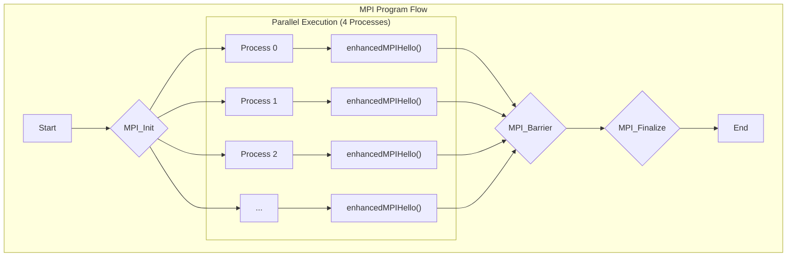
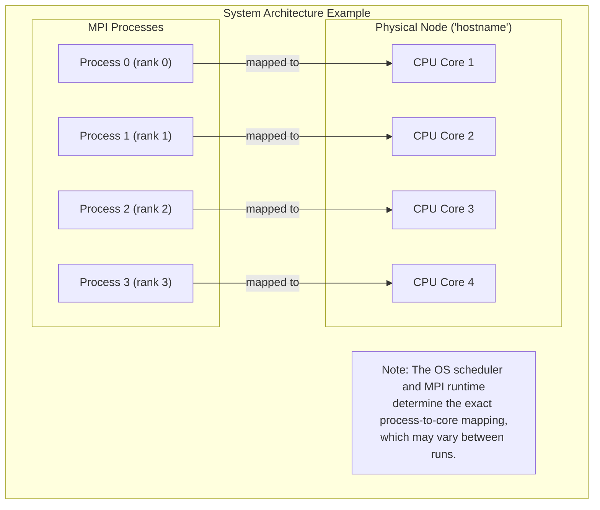
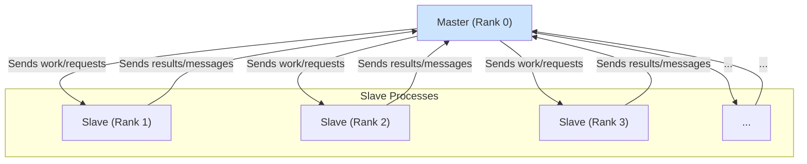
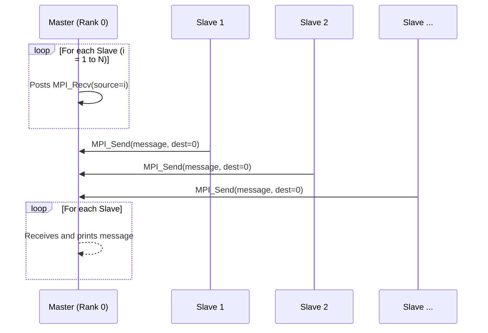
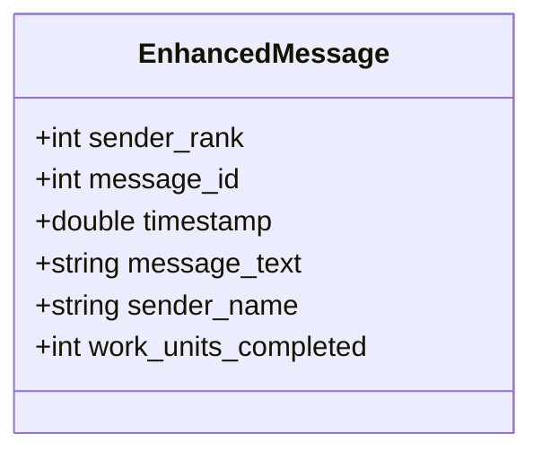
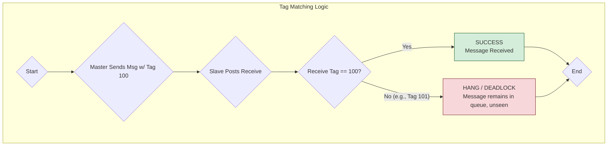
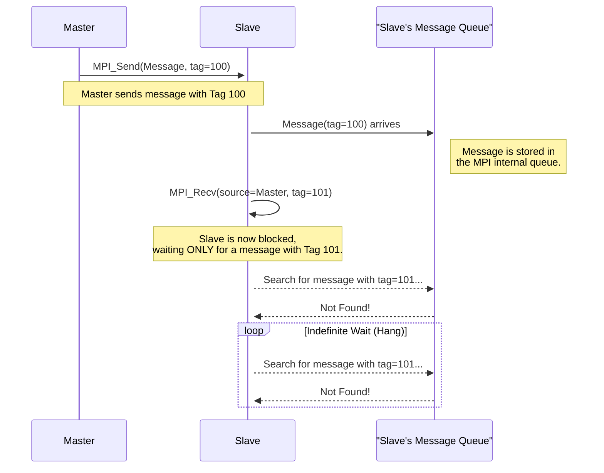
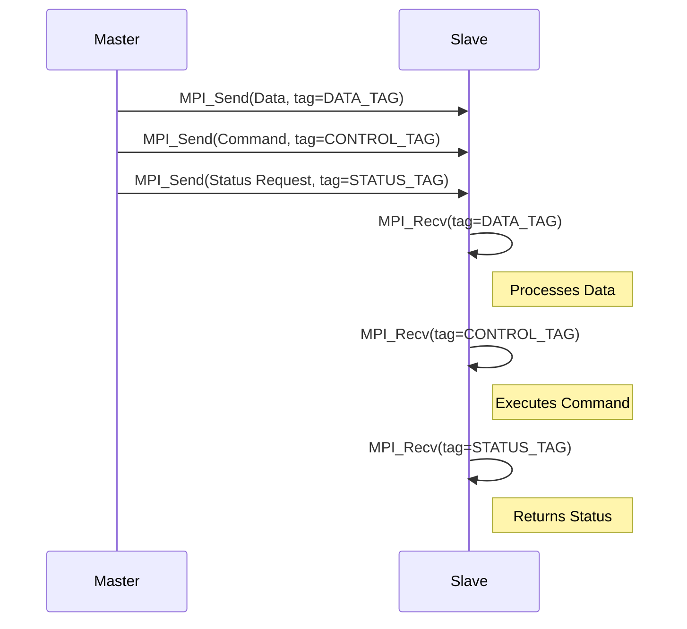

# Screenshot and Diagram Guide

## 📸 Part A: MPI Hello World Enhanced

### Key Screenshots to Capture

- **Program Execution Output**:
  - Terminal showing the full program run with `mpirun -np 4`.
  - Shows cluster verification info, process mapping, and system details.
- **Process Mapping Section**:
  - The part showing each process running on different CPU cores.
  - Demonstrates MPI process-to-processor mapping.

### Key Code Sections

- **MPI Initialization and Communication**

### Recommended Diagrams

- Process Flow Diagram showing 4 processes executing in parallel.
- System Architecture showing how processes map to CPU cores.

---

## 📸 Part B: MPI Master-Slave Enhanced

### Key Screenshots to Capture

- **Master-Slave Communication Output**:
  - Basic communication where slaves send "Hello back".
  - Personalized communication with different names.
  - Enhanced structured messages.
- **Core Communication Code**
- **Slave Sending Code**
- **Enhanced Message Structure**

### Recommended Diagrams

- Master-Slave Architecture showing 1 master + 3 slaves.
- Communication Flow showing bidirectional message passing.
- Message Structure showing the `EnhancedMessage` class fields.

---

## 📸 Part C: MPI Message Tags Enhanced

### Key Screenshots to Capture

- **Working Tag Communication (100↔100)**:
  - Terminal output showing successful message exchange.
  - All processes sending/receiving with matching tags.
- **Hanging Tag Communication (100→101)**:
  - The explanation text about why it hangs.
  - Timeout mechanism preventing infinite hang.
- **Tag Constants and Structure**
- **Tag Mismatch Explanation Code**
- **Advanced Tag Usage**:
  - Priority system with `HIGH_PRIORITY_TAG` and `LOW_PRIORITY_TAG`.
  - `MPI_ANY_TAG` wildcard demonstration.

### Recommended Diagrams

- Tag Matching Matrix showing working vs. hanging scenarios.
- Message Queue Visualization showing how unmatched messages accumulate.
- Tag-based Message Routing showing different message types.

---

## 📊 Summary Tables

### 1. Program Comparison

| Feature              | Part A                           | Part B                     | Part C                      |
| -------------------- | -------------------------------- | -------------------------- | --------------------------- |
| **Purpose**          | Hello World + Process Mapping    | Master-Slave Communication | Message Tag Demonstration   |
| **Processes**        | All equal (SPMD)                 | 1 Master + N Slaves        | 1 Master + N Slaves         |
| **Communication**    | Collective (Broadcast, Reduce)   | Point-to-Point (Send/Recv) | Tagged Point-to-Point       |
| **Key MPI Features** | Process topology, Collective ops | Master-slave pattern       | Message tags, Deadlock demo |

### 2. MPI Communication Patterns

| Pattern             | Used In   | Description               | Code Example                  |
| ------------------- | --------- | ------------------------- | ----------------------------- |
| **Collective**      | Part A    | All processes participate | `MPI_Bcast()`, `MPI_Reduce()` |
| **Point-to-Point**  | Part B, C | Direct process-to-process | `MPI_Send()`, `MPI_Recv()`    |
| **Tagged Messages** | Part C    | Message filtering by tag  | `MPI_Send(..., tag, ...)`     |

### 3. C++ Features Used

| Feature                | Part A             | Part B             | Part C             | Benefit                |
| ---------------------- | ------------------ | ------------------ | ------------------ | ---------------------- |
| **Classes**            | `✓ MPIHelloWorld`  | `✓ MPIMasterSlave` | `✓ MPIMessageTags` | Code organization      |
| **STL Containers**     | `✓ vector, string` | `✓ vector, string` | `✓ string`         | Memory management      |
| **Exception Handling** | `✓ try-catch`      | `✓ try-catch`      | `✓ try-catch`      | Error handling         |
| **`constexpr`**        | `✓`                | `✓`                | `✓`                | Compile-time constants |

---

## 🎯 Specific Screenshot Recommendations

### For Academic Reports

- **Split-screen shots showing**:
  - Code on left, execution output on right.
  - Before/after comparisons (C vs C++).
- **Annotated code snippets with**:
  - Arrows pointing to key MPI functions.
  - Colored highlighting of important sections.
  - Comments explaining the flow.
- **Terminal outputs showing**:
  - Full program execution from start to finish.
  - Process IDs and CPU core assignments.
  - Timing information and performance metrics.

### For Presentations

- High-level architecture diagrams.
- Code flow charts showing decision points.
- Communication sequence diagrams.
- Performance comparison charts.

---

_This document provides a guide for what to capture. Feel free to ask for help creating any specific diagrams or identifying exact line numbers for screenshots._
